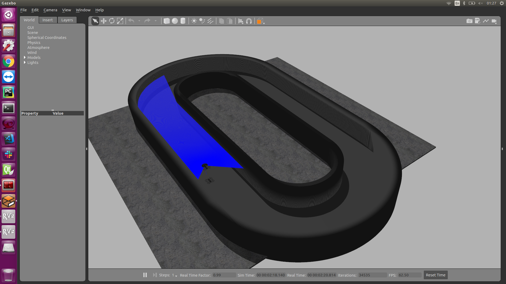

# EE405 F1tenth Project (F1TENTH Racecar Simulator)
This project is based on F1TENTH Project.

[https://github.com/Leedk3/EE405_a_eurecar_f1_tenth_project](https://github.com/Leedk3/EE405_a_eurecar_f1_tenth_project)

This project is based on F1TENTH Project.
Please refer to the following site:

[https://f1tenth.org/](https://f1tenth.org/)

[https://github.com/f1tenth-dev/simulator](https://github.com/f1tenth-dev/simulator)

Also, this project provides gazebo simulator and messages. 
Therefore, it is a proper environment to implement such as vehicle control, simple mapping, and localization algorithm. We hope you to try whatever you want to test in this simulator. 

As the class progresses, you can experience installing sensors required for algorithms in the vehicle and using them to integrate them into their own algorithms.
We can modifiy the origin f1tenth model for you to use an IMU sensor, 2D LiDAR scanner, camera. 
Finally, we will use the same track model as the students experimenting on a real vehicle basis.

## Install guide

### ROS

Until the last lesson, we have covered ROS installation and basic usage, so we will assume that have ```ros-melodic-desktop``` installed.

if you have not installed ```ros-melodic-desktop```, you can follow the instruction here:
[ROS-melodic-installation/Ubuntu](http://wiki.ros.org/melodic/Installation/Ubuntu)

Also, you can follow the documentation to start ROS and set the environment to use ros-command comfortably.
See this page: [ROS/StartGuide](http://wiki.ros.org/ROS/StartGuide)

If you have ```ros-melodic-desktop``` installed, the additional dependencies you must install are:

- tf2_geometry_msgs
- ackermann_msgs
- joy
- map_server

You can install them by running:

    sudo apt-get install ros-melodic-tf2-geometry-msgs ros-melodic-ackermann-msgs ros-melodic-joy ros-melodic-map-server ros-melodic-teleop-twist-keyboard ros-melodic-navigation ros-melodic-teb-local-planner* ros-melodic-ros-control ros-melodic-ros-controllers ros-melodic-gazebo-ros-control ros-melodic-ackermann-msgs ros-melodic-serial qt4-default ros-melodic-effort-controllers

The full list of dependencies can be found in the ```package.xml``` file.


---------------------


### Simulator package download

To install the simulator package, clone the repo with the simulator and starter code into your catkin workspace:

    cd ~/catkin_ws/src
    git clone https://github.com/Leedk3/EE405_a_eurecar_f1_tenth_project.git
    
Personally, I installed the simulator package in the ```~/test_catkin_ws``` because I have installed other packages in the ```~/catkin_ws```. If you want to separate the workspace as I did, you can make a new directory as I created.
As a result, I did: 

    cd ~/f1_ws/src
    git clone https://github.com/Leedk3/EE405_a_eurecar_f1_tenth_project.git


### For gazebo environment
The source for the required packages, including the simulator, are now in the workspace. The simulator depends on the GPU particle filter developed by the MIT RACECAR team and this package has to be configured before compiling the ROS packages. Navigate to the ```range_libc``` folder to compile the library necessary for the particle filter. Open a new terminal and enter the following commands:

    pip2 install --user cython

There are two methods for installing the particle filter; with GPU support and without GPU support. We recommend using the package with GPU support, but leave the decision to you.

**Installing with GPU Support**  
Keep this terminal open and pay special attention to the next step. The particle filter package depends heavily on the GPU and its architecture, so it becomes very important to match the architecture of the GPU in your local machine to the one listed in the configuration of `setup.py`. 

    ~/f1_ws/src/range_libc/pywrapper
    gedit setup.py

We are particularly interested in the `sm_xx` value associated with the GPU and more information can be found in this [article](https://arnon.dk/matching-sm-architectures-arch-and-gencode-for-various-nvidia-cards/) which is a good reference for understanding types NVIDIA's GPU. Once the architecture type has been identified, go back to the terminal and open the setup file using an editor of your choice and navigate to line 96:

```python
nvcc_flags = ['-arch=sm_20', '--ptxas-options=-v', '-c', '--compiler-options', "'-fPIC'", "-w","-std=c++11"]
```

Replace `-arch=sm_20` with the `-arch=sm_xx` value from the article in the link provided above. Personally, I use NVIDIA 2080 GPU, I have changed it `-arch=sm_75`. Once you have made the changes, save the file and exit back to the terminal and enter the following command to compile the library and follow the instruction on the screen:

    ~/f1_ws/src/range_libc/pywrapper
    ./compile_with_cuda.sh


**Installing without GPU Support**  
In the same terminal, enter the following command and follow the instructions in the screen:


    ./compile.sh
    


### Simulator package installation    
Then run ```catkin_make``` to build it:

    cd ~/catkin_ws
    catkin_make
    source devel/setup.bash

In my case, I worked in the ```test_catkin_ws``` directory and I did:

    cd ~/f1_ws
    catkin_make
    source ~/test_catkin_ws/devel/setup.bash
        
    

## Quick Start

### Run the simulator

For using customized track as like oval-shaped track, you need to copy some files in ~/.gazebo/models (If you don't have the directory, run ```mkdir -p ~/.gazebo/models```)
We generated oval track with CAD software and exported the CAD model into *.stl format.

    cp -r EE405_a_eurecar_f1_tenth_project/f1tenth-sim/world/oval_track ~/.gazebo/models

To run the simulator on its own, run:

    roslaunch f1tenth_simulator simulator.launch

This will launch everything you need for a full simulation; roscore, the simulator, a preselected map, a model of the racecar and the joystick server.

You can change the gazebo world map by modifying the 'world_name' argument in the simulator.launch file.


 


### Manually control the vehicle in the simulator

For manual control using your keyboard inputs, run this package:

```
user@ros-computer: rosrun f1tenth-sim keyboard_teleop.py car_1
```

Click the terminal where the keyboard_teleop node is running, and press your keyboards to control your vehicle.

- w a d s : forward, left, right, backward
- space_bar : brack 

### Example: Mapping the track

You can test to generate a 2-D map using a sensor model in the gazebo environment. This figure is an example of map building process in gazebo environment. The sensors used for map building are 2D Hokuyo LiDAR and 3DM-GX5-25 IMU sensors.



Here is the result of the generated 2D map using Google Cartographer in the track.


As a 2D map building algorithm, Hector SLAM, Gmapping, and Cartographer are mainly used. Please refer to the following site:

Hector SLAM: [http://wiki.ros.org/hector_slam]

Gmapping: [http://wiki.ros.org/gmapping](http://wiki.ros.org/gmapping)

Google Cartographer: [https://google-cartographer-ros.readthedocs.io/en/latest/#](https://google-cartographer-ros.readthedocs.io/en/latest/#)


Note that when using a Cartographer, the vehicle's odometry may be necessary to increase the accuracy of map building performance. In the 2D map generated by these map building algorithm, we can estimate the position of the vehicle using LiDAR and IMU sensor data.

## Troubleshooting

Issue 1) Failed to start controller in realtime loop. This should never happen.

: Upgrade your ROS libraries

```
sudo apt-get --only-upgrade install ros-*
```

Issue 2) [REST.cc:205] Error in REST request

: You need to change a line at ~/.ignition/fuel/config.yaml as following.

Modify the line

url: https://api.ignitionfuel.org

to

url: https://api.ignitionrobotics.org


